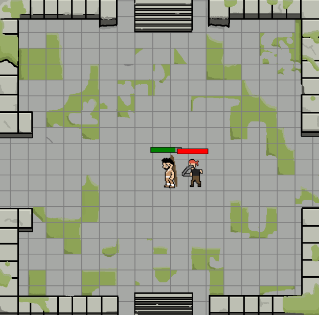
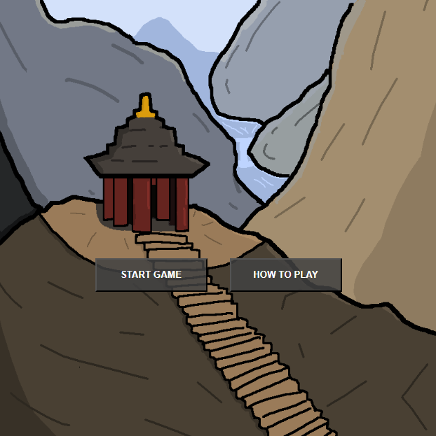
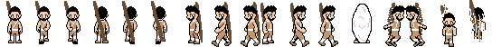
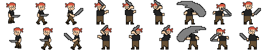

# 🎮 **Timeless Ascension** ⏳ 

> In Timeless Ascension you play as Kaelen, a warrior equipped with a divine relic - a staff. This staff allows you to manipulate time (by slowing or speeding up enemies). However, slowing down time damages you over time and speeding up time heals you over time.
>
> While you were searching for other divine relics you encountered a leader of small group (boss). He wasn't pleased with your presence during his own search for other divine relics and you ended up in a fight against this boss.
>
> Now it's up to you and your staff's time-manipulating-abilities to defeat this boss.

---

## 🌐 **Play the Game**
[Click here to play the game!](https://ealex85.github.io/CCL1/)

---

## 📸 **Screenshots**

### Main Gameplay:

  
  
*Figure 1: Example of gameplay in action.*

---

### Menu and UI:

  
  
*Figure 2: Menu and user interface.*

---

## 🎨 **Spritesheets**
Below are the sprites used to create characters and objects in the game:

### Player Character:

  
  
*Figure 3: Player character animations.*

---

### Enemies and NPCs:

  
  
*Figure 4: Enemy animations.*

---

## 🕹️ **Controls**

You only need your keyboard to play this game. Except for the WASD-Keys, you only need to tap the keys, not hold them.

- WASD: Movement
- Shift: Dash
- J: Attack -> hits in all directions
- K: Slow down time/enemy (you lose hp over time)
- L: Speed up time/enemy (you gain hp over time)

---

## 🔧 **Gameplay Mechanics**

Player:
- Attack has a cooldown of 1.3 seconds
- Dash has a cooldown of 0.5 seconds
- If slow (time-manipulation) is active, your hp can reach 0 and you die (it won't be automatically canceled if hp is low)

Enemy: 
- Attacks have a cooldown of 3 seconds
    - if slow is active -> attack cooldown 5.5 seconds (slower attacks)
    - if speed is active -> attack cooldown 1.5 seconds (faster attacks)
- Gains hp slowly over time
- Chases you constantly
- Stops only when Player stands still and if enemy is close enough to the player/if hitboxes are triggered

Collisions:
- Along the canvas there are invisible walls placed, making the playground a square (almost)
- Player needs to collide with enemy to be able to inflict damage
- Enemy attacks when it's colliding with attack-triggers (which are attached to the player)

---

## 🐛 **Bugs & Known Issues:**
- When starting the game, enemy might not be on the canvas -> simply refresh the page and enemy should appear
- Enemy collision: walks around you until a certain threshold is triggered
- Enemy attack patterns: enemy can hit you even if the animation isn't fully played

---

## ✍️ **Reflection**

### What went well:
- **Core Mechanics:** Implementing the basic mechanics went better and faster than expected.
- **Art & Design:** Even though I'm not good at drawing, the sprites were fun to design.

### Challenges:
- **Time Constraints:** Implementing all the features I envisioned wasn’t possible due to the limited timeframe.
- **Game Polish:** Refining the game wasn't as easy as I thought. Especially the enemy still needs more polishing.
- **Useful Mechanics:** Despite being able to manipulate time, it was difficult to make the use of it feel rewarding.

### Lessons Learned:
- **Prototyping Matters:** Testing early prototypes gives you a solid foundation to build on.
- **Keep it Simple:** It's better to have a few polished mechanics than multiple (clunky) ones.
